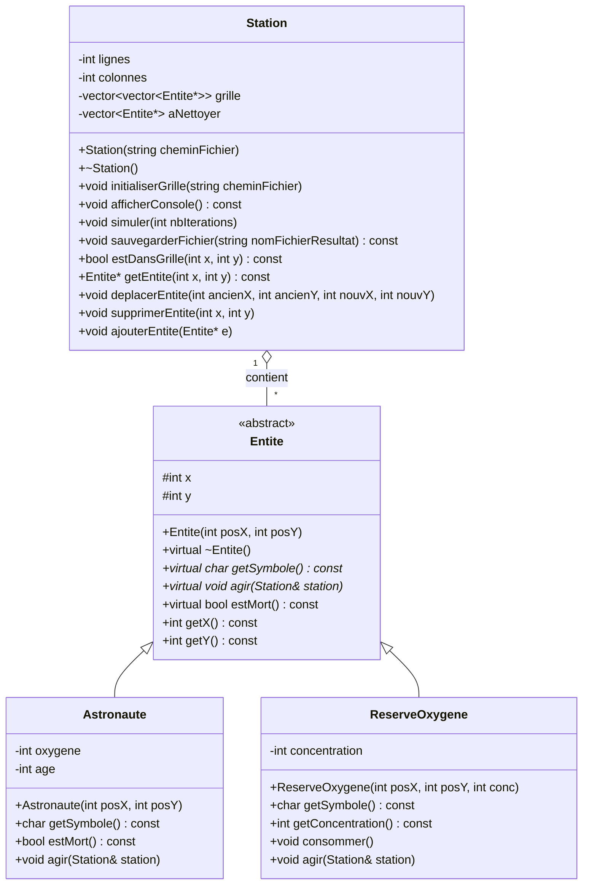
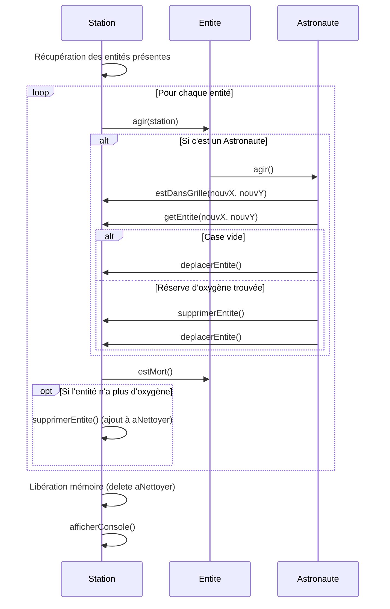

# Simulateur de Station Spatiale 

Ce projet est une simulation orientée objet d'une station spatiale contenant des astronautes (S) et des réserves d'oxygène (O) .

## Comment compiler le projet

Ouvrez le terminal dans le dossier du projet et tapez la commande suivante pour compiler tous les fichiers .cpp :

g++ *.cpp -o simulation.exe

## Comment lancer la simulation

Une fois le projet compilé exécutez le programme  :

.\simulation.exe station_initialisation.txt

## Affichage et Résultats
- Mode console : L'évolution de la grille est affichée étape par étape dans le terminal.
- Mode fichier : À la fin de la simulation, la grille finale est automatiquement sauvegardée dans un fichier texte.(Ce fichier est automatiquement recréé et mis à jour à chaque nouvelle exécution du programme)

---

## Modélisation (UML)

### Diagramme de Classes

### Diagramme de Séquence (Une Itération de la Simulation)

## Rapport Court

**1. Choix de conception :**
- **Polymorphisme :** Utilisation d'une classe abstraite `Entite` regroupant les propriétés communes (x , y) et une méthode agir(). Cela permet à la station de gérer n'importe quel type d'objet via un  std::vector<std::vector<Entite*>>.
- **Nettoyage différé :** Plutôt que de détruire les entités immédiatement pendant la boucle elles sont placées dans un vecteur aNettoyer puis détruites à la fin du tour pour éviter les erreurs de modification en pleine itération.

**2. Difficultés rencontrées :**
La principale difficulté a été de bien gérer la mémoire et les cases vides pour éviter que le programme ne plante. Il fallait toujours s'assurer qu'on ne faisait pas interagir un personnage qui venait juste de disparaître. Un autre problème était lié aux déplacements : au début, un astronaute qui descendait dans la grille pouvait parfois jouer une deuxième fois de suite dans le même tour. Pour régler ça, j'ai choisi de faire une liste de tout le monde au tout début du tour, pour m'assurer que chaque élément ne bouge qu'une seule fois.
